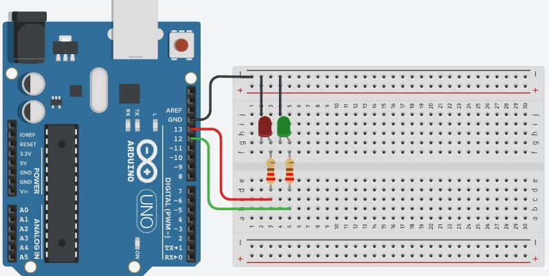

# Projeto Arduíno de semáforo de 2 luzes.

## Contextualização

Neste experimento faremos um semáforo de 2 luzes com dois LEDs de forma  que acendam e apaguem em sequência utilizando o pino digital 13 (pino digital incorporado LED_BUILTIN = 13) e o pino digital 12. 

## Esquema do projeto

## Projeto no Tinkercad

https://www.tinkercad.com/things/30gPvdPObVD